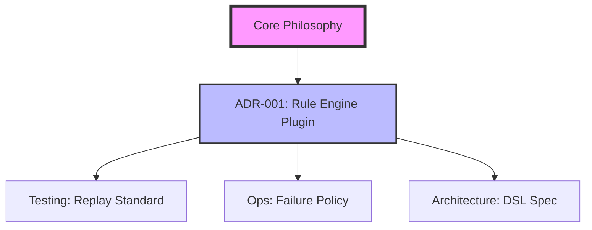

# ADR Index (設計決定記録索引)

本プラットフォームの「憲法」としての役割を果たす設計決定の記録です。

| ID | 決定事項 | ステータス | 最終更新 |
| :--- | :--- | :--- | :--- |
| [001](./001_rule_engine_pluginization.md) | 剣道ルールエンジンのプラグイン化と階層型Configの導入 | Accepted | 2026-05 |

---

## 🗺 ADR Dependency Map (依存関係図)

> **解説:** 
> - **ADR-001** はシステムの「心臓部」であり、すべてのルール追加はこの決定に基づきます。
> * 今後追加される「リプレイの互換性」や「自動化」に関するADRは、すべてADR-001の「冪等な純粋関数」という制約を継承します。

> ※ 新しいADRを追加する際は `docs/governance/adr_template.md` を使用してください。